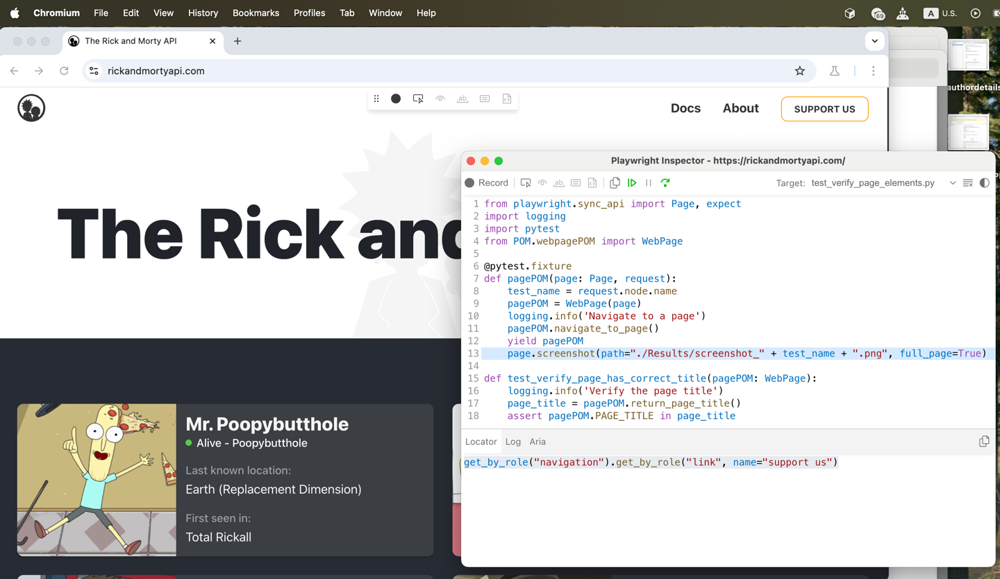

This repo contains examples for testing https://rickandmortyapi.com/ website using [Playwright](https://playwright.dev/)  with its [Python](https://github.com/microsoft/playwright-python) implementation
and API testing using python/[pytest](https://docs.pytest.org/en/stable/).

API documentation can be found [here](https://rickandmortyapi.com/documentation).

All test cases are located in `/Tests` folder, while UI testing methods and elements definitions are in `/POM` folder.


# How to find elements on a web page

The easiest way to locate elements on a web page is to run your test in a debugging mode and use Pick Locator option in Playwright Inspector - see a screenshot.
```
% PWDEBUG=1 pytest -s -k test_case_name
```



Another way is to use Inspect option in your browser.


# How to Execute Playwright tests
To run all tests in a headless mode without showing a browser, open a terminal and type:
```
pytest
```

To run all tests in a headed mode:
```
pytest --headed
```

To run all test cases in a specific file:
```
pytest Tests/test_verify_page_elements.py 
```

To execute a specific test case:
```
pytest -s -k test_verify_navigation_to_docs_page
```

To generate reports, install `pip install pytest-html` and use `--html` option while running scripts: 
```
pytest --html=Results/verify.html Tests/test_verify_page_elements.py
```

# How to Execute API tests
To execute API test cases only and see the logs:
```
pytest -s test_api.py
```